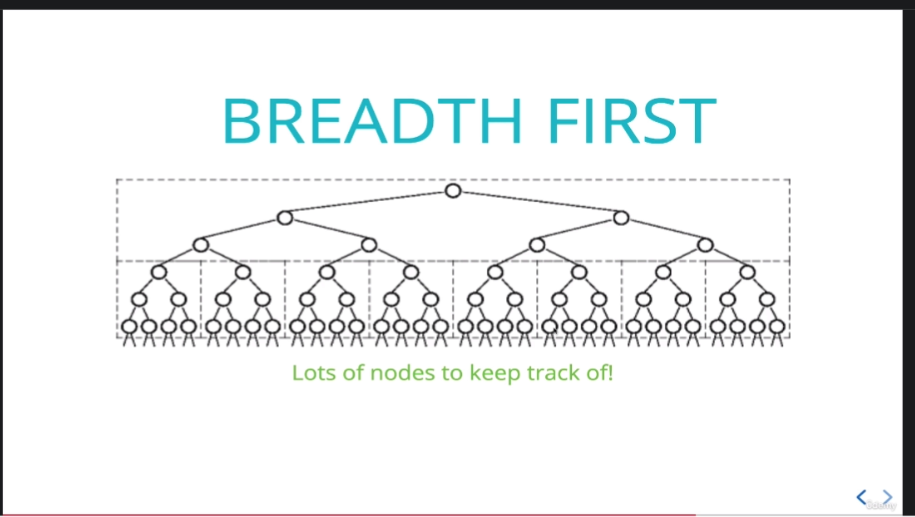
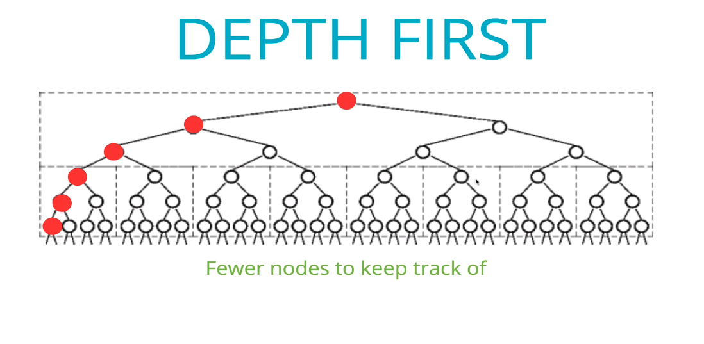
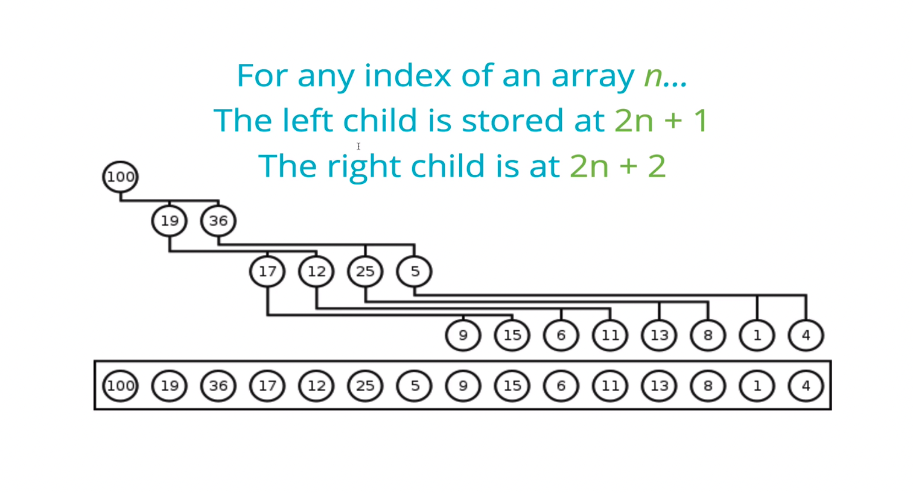
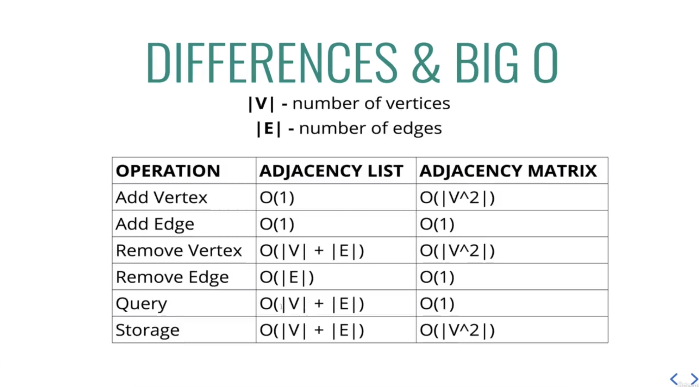

# DFS - PostOrder


## code
```javascript
  DFSPostOrder() {
    let visited = [],
      current = this.root;
    function traverse(node) {
      if (node.left) traverse(node.left);
      if (node.right) traverse(node.right);
      visited.push(node.value);
    }
    traverse(current);
    return visited;
  }

```

# DFS - InOrder


## code 
```javascript 
  DFSInOrder() {
    let visited = [];

    function traverse(node) {
      if (node.left) traverse(node.left);
      visited.push(node.value);
      if (node.right) traverse(node.right);
    }
    traverse(this.root);
    return visited;
  }
```

## comparing BFS and DFS






in Breadthe first , we have to track a lot of nodes.

in two time complexity is the same.
space complexity depends on the structure's tree.

#### Breadth first 
Used commonly with **BTS's** Notice we get all nodes in the ree in their underlying order.

#### Preorder
can be used to "export" a tree structure so that is easily reconstucted or copied.

# Recap
- Trees are non-linear data structures that contain a root and child nodes
- Binary tree can have values of any type, bu at most two children for each parent.
- Binary search trees are a more specific version of binary trees where every node to the left of a parent is less thann it's value and every node to the right is greater
- We can search through Trees using BFS and DFS.


# Binary Heaps 

## what is a binary heap?

very similar to a binary seach tree, but with some different rules.

In a **MaxBinaryHeap**, parent nodes are always larger than child nodes. In a **MinBinaryHeap**, parent nodes ares always smaller than child nodes.

## Max binary heap
- each parent has at most two child nodes
- the value of each parent node is **always** greater than its child nodes.
- in a max Binary Heap the parent is grater than than the children, but there are no garantees between sibling node.
- Abinary heap is as compact as possible. All the children of each node are as full as the can be and left children are fillef out first.

binary heaps are used to implement priority queues, which are very commonly used data structures
they are also ussed quiete a bit , with **graph traversal** algorithms.



For any child node at index **n**, its parent is at index **(n-1)/2** floored.

## code for insert method

```javascript 
class MaxBinaryHeap {
  constructor() {
    this.values = [];
  }
  insert(value) {
    this.values.push(value);

    let index = this.values.length - 1;

    while (index > 0) {
      let parentIndex = Math.floor((index - 1) / 2);
      let element = this.values[index];
      let parent = this.values[parentIndex];

      if (parent >= element) break;

      this.values[parentIndex] = element;
      this.values[index] = parent;

      index = parentIndex;
    }
  }
}
```

## removing from heap
- remove the root 
- replace with the most recently added 
- ajust (sink down)

## method video
```javascript 
  extractMax() {
    const max = this.values[0]
    const end = this.values.pop()
    if (this.values.length > 0) {
      this.values[0] = end
      this.sinkDown()
    }
    return max
  }
    extractMax() {
    const max = this.values[0]
    const end = this.values.pop()
    if (this.values.length > 0) {
      this.values[0] = end
      this.sinkDown()
    }
    return max
  }
  sinkDown() {
    let idx = 0
    const length = this.values.length
    const element = this.values[0]
    while (true) {
      let leftChildIdx = 2 * idx + 1
      let rightChildIdx = 2 * idx + 2
      let leftChild, rightChild
      let swap = null
 
      if (leftChildIdx < length) {
        leftChild = this.values[leftChildIdx]
        if (leftChild > element) {
          swap = leftChildIdx
        }
      }
      if (rightChildIdx < length) {
        rightChild = this.values[rightChildIdx]
        if (
          swap === null && rightChild > element ||
          swap !== null && rightChild > leftChild
        ) {
          swap = rightChildIdx
        }
      }
 
      if (swap === null) break;
      this.values[idx] = this.values[swap]
      this.values[swap] = element
      idx = swap
    }
  }
```

## building a priority queue

### what is?
is a Data structure where each element has a priority. Elements with higher priorities are served before elements with lower priorities.

## classes

```javascript
class PriorityQueue {
  constructor() {
    this.values = [];
  }
}

class Node {
  constructor(val) {
    this.value = val;
    this.priority;
  }
}
```
## enqueu and dequeu method
```javascript
  enqueu(val, prio) {
    let newNode = new Node(val, prio);
    this.values.push(newNode);

    let index = this.values.length - 1;

    while (index > 0) {
      let parentIndex = Math.floor((index - 1) / 2);
      let element = this.values[index];
      let parent = this.values[parentIndex];

      if (parent.priority <= element.priority) break;

      this.values[parentIndex] = element;
      this.values[index] = parent;

      index = parentIndex;
    }
  }
  dequeu() {
    const max = this.values[0];
    const end = this.values.pop();
    if (this.values.length > 0) {
      this.values[0] = end;
      this.sinkDown();
    }
    return max;
  }
  sinkDown() {
    let idx = 0;
    const length = this.values.length;
    const element = this.values[0];
    while (true) {
      let leftChildIdx = 2 * idx + 1;
      let rightChildIdx = 2 * idx + 2;
      let leftChild, rightChild;
      let swap = null;

      if (leftChildIdx < length) {
        leftChild = this.values[leftChildIdx];
        if (leftChild.priority < element.priority) {
          swap = leftChildIdx;
        }
      }
      if (rightChildIdx < length) {
        rightChild = this.values[rightChildIdx];
        if (
          (swap === null && rightChild.priority < element.priority) ||
          (swap !== null && rightChild.priority < leftChild.priority)
        ) {
          swap = rightChildIdx;
        }
      }

      if (swap === null) break;
      this.values[idx] = this.values[swap];
      this.values[swap] = element;
      idx = swap;
    }
  }
```

## Recap
- Binary Heaps are very useful data structures for sorting, and implementing other data structures like priority queues.
- Binary Heaps are either MaxBinaryHeaps or MinBinaryHeaps with parents either being smaller or larger than their children.
- with just a little bit of math, we can represent heaps using arrays.

# Hash Table 
hash table are used to store *key-value* pairs.
they are like arrays, but the keys are not ordened.
Unlike arrays, hash tables are fast for all the following operations: finding values, adding new values, and removing values.

## the hash part
to implement a hash table, we'll be using an array.
In order to look up values by key, we need a way to *convert keys into valid array indices.*

A function that performs this task is called a **hash function**.

## what makes a good hash?
1. Fast (i.e. constant time)
2. Doesn't cluster outputs at specific indices, but distribues uniformily
3. Deterministic

## example hash function

```javascript
function hash(key, arrlen) {
  let total = 0;
  let WEIRD_PRIME = 71;
  for (let i = 0; i < Math.min(key.length, 100); i++) {
    let char = key[i];
    let value = char.charCodeAt(0) - 96;
    total = (total * WEIRD_PRIME + value) % arrlen;
  }

  return total;
}
```

## A hash table class

```javascript
class HashTable {
  constructor(size = 53) {
    this.keyMap = new Array(size);
  }

  _hash(key) {
    let total = 0;
    let WEIRD_PRIME = 71;
    for (let i = 0; i < Math.min(this.keyMap.length - 1, 100); i++) {
      let value = key.charCodeAt(i) - 96;
      total = (total * WEIRD_PRIME + value) % this.keyMap.length;
    }

    return total;
  }
  set(key, value) {
    let index = this._hash(key);

    if (!this.keyMap[index]) {
      this.keyMap[index] = [];
    }
    this.keyMap[index].push([key, value]);
  }
  get(key) {
    let index = this._hash(key);

    if (this.keyMap[index]) {
      for (let i = 0; i < this.keyMap[index].length; i++) {
        if (this.keyMap[index][i][0] === key) {
          return this.keyMap[index][i][1];
        }
      }
    }
    return undefined;
  }
  values() {
    let values = [];

    for (let i = 0; i < this.keyMap.length; i++) {
      if (this.keyMap[i]) {
        for (let j = 0; j < this.keyMap[i].length; j++) {
          if (!values.includes(this.keyMap[i][j][1])) {
            values.push(this.keyMap[i][j][1]);
          }
        }
      }
    }
    return values;
  }
  keys() {
    let values = [];

    for (let i = 0; i < this.keyMap.length; i++) {
      if (this.keyMap[i]) {
        for (let j = 0; j < this.keyMap[i].length; j++) {
          if (!values.includes(this.keyMap[i][j][0])) {
            values.push(this.keyMap[i][j][0]);
          }
        }
      }
    }
    return values;
  }
}
```

# Graphs 
A **graph data structure** consists of a finite (and possibly mutable) set of vertices or nodes or points, together with a set of unordered pairs of these vertices for an  undirected **graph** or a set of ordered pairs of a directed **graph**

## big O and diferences 
